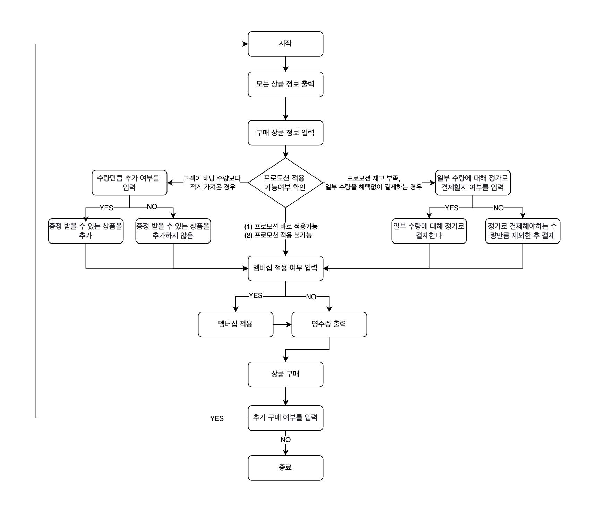

# 🏪 편의점

----

```
편의점에 배치된 상품 목록을 구매하고, 할인 정보를 계산해 영수증을 출력하는 프로젝트입니다.
```
### 🔄  프로그램 동작 순서  

----




### 🖥️ 기능 구현 목록

----

### ✅ 입력 기능
- [ ] 구매할 상품명과 수량을 입력받는다. `(ex [사이다-2],[감자칩-1])`
  - [ ] **[예외]** `(ex [사이다-2],[감자칩-1])` 와 같은 형식이 아닐 경우 예외를 발생시킨다.
  - [ ] **[예외]** 공백을 입력했을 경우 예외를 발생시킨다.
- [ ] 멤버십 할인 여부를 입력받는다. 
  -[ ] **[예외]** `Y` 또는 `N` 이 아닐 경우 예외를 발생시킨다.

- [ ] 프로모션 적용이 가능한 상품에 대해 고객이 해당 수량보다 적게 가져온 경우, 그 수량만큼 추가 여부를 입력받는다.  
  - [ ] **[예외]** `Y` 또는 `N` 이 아닐 경우 예외를 발생시킨다.
- [ ] 프로모션 재고가 부족하여 일부 수량을 프로모션 혜택 없이 결제해야 하는 경우, 일부 수량에 대해 정가로 결제할지 여부를 입력받는다.  
  - [ ] **[예외]** `Y` 또는 `N` 이 아닐 경우 예외를 발생시킨다.
- [ ] 추가 구매 여부를 입력받는다.
  - [ ] **[예외]** `Y` 또는 `N` 이 아닐 경우 예외를 발생시킨다. 

### ✅ 출력 기능
- [ ] 모든 상품 정보`(상품이름, 수량, 가격)` 을 출력한다.
- [ ] 최종 결제 내역`(영수증)` 을 출력한다.
  - [ ] 구매한 상품 정보`(상품 이름, 수량, 가격)`, 증정받은 상품 정보`(상품 이름, 수량)`, 금액`(총 결제 금액, 행사 할인, 멤버십 할인, 지불 금액)`

### ✅ 상품 재고 관리 기능
- [ ] 제공된 프로모션 데이터를 저장한다.
- [ ] 제공된 상품 데이터를 저장한다.
- [ ] 모든 상품 정보를 조회한다.
- [ ] 상품 이름으로 재고를 조회한다.
  - [ ] **[예외]** 존재하지 않는 상품 이름일 경우 예외를 발생한다.
  - [ ] **[예외]** 구매 수량이 재고 수량을 초과한 경우 예외를 발생한다. 
- [ ] 프로모션이 적용된 상품 정보를 조회한다.
- [ ] 프로모션이 적용되지 않은 상품 정보를 조회한다.

### ✅ 상품 구매 기능
- [ ] 상품을 구매한다.
  - [ ] **[예외]** 상품 수량이 부족할 경우 예외를 발생한다. 
  

### ✅ 장바구니 기능
- [ ] 주문 상품에 대한 정보를 가진다.
- [ ] 총 주문 금액을 계산한다.
- [ ] 프로모션 할인 금액을 계산한다.
- [ ] 멤버십 할인 금액을 계산한다.
- [ ] 지불 금액을 계산한다.
- [ ] 총 주문 정보(영수증)를 생성한다.


### ✅ 프로모션 할인 기능
- [ ] `오늘 날짜`가 프로모션 기간 내에 포함된 경우에만 할인을 적용한다.
- [ ] 프로모션은 `N`개 구매 시 `1`개 무료 증정`(Buy N Get 1 Free)`의 형태로 진행된다.
- [ ] `1+1` 또는 `2+1` 프로모션이 각각 지정된 상품에 적용되며, 동일 상품에 여러 프로모션이 적용되지 않는다.
- [ ] 프로모션 혜택은 프로모션 재고 내에서만 적용할 수 있다.
- [ ] 프로모션 기간 중이라면 프로모션 재고를 우선적으로 차감하며, 프로모션 재고가 부족할 경우에는 일반 재고를 사용한다.
- [ ] 프로모션 적용이 가능한 상품에 대해 고객이 해당 수량보다 적게 가져온 경우, 필요한 수량을 추가로 가져오면 혜택을 받을 수 있음을 안내한다.
  - [ ] 필요한 수량을 추가로 가져오면, 일부 수량에 대해 정가로 결제한다.
  - [ ] 필요한 수량을 가져오지 않으면, 정가로 결제해야하는 수량만큼 제외한뒤 결제한다.
- [ ] 프로모션 재고가 부족하여 일부 수량을 프로모션 혜택 없이 결제해야 하는 경우, 일부 수량에 대해 정가로 결제하게 됨을 안내한다.
  - [ ] 사용자의 동의를 얻으면, 일부 수량에 대해 정가로 결제한다.
  - [ ] 사용자의 동의를 얻지 않으면, 정가로 결제해야하는 수량만큼 제외한 후 결제를 진행한다.

### ✅ 멤버십 할인 기능
- [ ] 멤버십 회원은 프로모션 미적용 금액의 `30%`를 할인받는다.
- [ ] 프로모션 적용 후 남은 금액에 대해 멤버십 할인을 적용한다.
- [ ] 멤버십 할인의 최대 한도는 `8,000`원이다.

### ✅ 예외 처리 기능
- [ ] 사용자가 잘못된 값을 입력할 경우 `IllegalArgumentException` 을 발생시키고, `"[ERROR]"`로 시작하는 에러 메시지를 출력한다.
    - [ ] `Exception` 이 아닌 `IllegalArgumentException, IllegalStateException` 등과 같은 명확한 유형을 처리한다.
- [ ] 사용자가 잘못된 값을 입력해 에러가 발생하면, 에러 발생 시점부터 입력을 다시 받는다.


### ⚠️ 체크 리스트

----

- [ ] JDK 21 버전에서 실행 가능한가?
- [ ] 프로그램 실행 시작점이 `Applciation` 의 `main()` 인가?
- [ ] `build.gradle` 파일을 변경하지 않았는가?
- [ ] 프로그램 종료시 `System.exit()` 를 호출하지 않았는가?
- [ ] 프로그래밍 요구 사항에 달리 명시하지 않는 파일, 패키지 등의 이름을 바꾸거나 이동하지 않았는가?
- [ ] 자바 코드 컨벤션을 지켰는가?
- [ ] `indent` 의 `depth` 를 `2`까지만 허용했는가?
- [ ] 3항 연산자를 쓰지 않았는가?
- [ ] 함수, 메서드의 길이가 15라인을 넘기지 않았는가?
- [ ] else 예약어를 쓰지 않았는가?
- [ ] Java Enum 을 적용했는가?
- [ ] 구현한 기능에 대한 단위 테스트를 적절히 작성했는가?
- [ ] 함수(또는 메서드)의 길이가 `10`라인을 넘어가지 않았는가?
- [ ] 함수(또는 메서드)가 한 가지 일만 잘 하도록 구현했는가?
- [ ] 입출력 담당 클래스를 별도로 구현했는가?
- [ ] `camp.nextstep.edu.missionutils`에서 제공하는 `DateTimes` 및 `Console` API를 사용하여 구현했는가?
